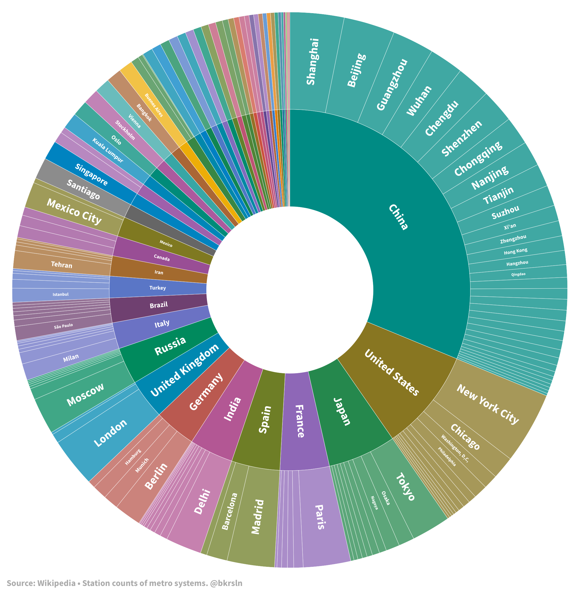

# Dünyadaki metro sistemleri

Dünyadaki tüm metro sistemlerine ait uzunluk, istasyon sayısı ve yıllık kullanım verilerini Flourish ile görselleştirdim.

:egg: Veri kaynağı olarak [List of metro systems](https://en.wikipedia.org/wiki/List_of_metro_systems) isimli Wikipedia maddesini kullandım.

:fried_egg: Verileri [import.io](https://www.import.io) kullanarak kazıdım.

:coffee: Görselleştirme aracı olarak [Flourish](https://flourish.studio) kullandım.

Veri görselleştirmesini interaktif olarak [buradan](https://public.flourish.studio/story/183353/), görsel olarak aşağıdan inceleyebilirsiniz.

---
**Yıllık kullanım**

*Tüm metroların kişi bazlı yıllık kullanımı 60.649.550.000, yani yaklaşık 61 milyar.*

**Günlük kullanım**

*Kişi bazlı günlük kullanımı ise 161.163.150, yani 161 milyon.*

**İstasyon sayısı**

**Uzunluk**

